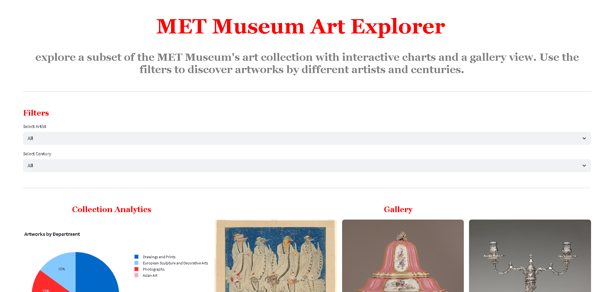

# 🎨 MET Museum Art Explorer

[](https://opensource.org/licenses/MIT)
[](https://www.python.org/)
[](https://fastapi.tiangolo.com/)
[](https://streamlit.io/)
[](https://www.mysql.com/)
[](https://www.docker.com/)

> Explore the Metropolitan Museum of Art's vast collection through an interactive web dashboard. This project provides a streamlined way to browse, filter, and visualize artworks from the MET's public API, with data stored in a MySQL database and served via a FastAPI backend.

The Website:
[MET Art Gallery](https://met-art-gallery.com/)

The Met Museum API
[MET Museum](https://www.metmuseum.org/)


## 📋 Table of Contents

- [✨ Features](#-features)
- [🏗️ Architecture](#️-architecture)
- [🛠️ Prerequisites](#️-prerequisites)
- [🚀 Installation & Setup](#-installation--setup)
- [📖 Usage](#-usage)
- [🐳 Dockerization](#-dockerization)
- [☁️ Deployment on AWS](#️-deployment-on-aws)
- [🤝 Contributing](#-contributing)
- [📄 License](#-license)

## ✨ Features

- **📊 Interactive Dashboard**: Built with Streamlit, featuring filters by artist and century, charts, and a gallery view.
- **🔍 Artwork Exploration**: Browse a curated subset of MET artworks with details like title, artist, year, century, department, and image.
- **⚡ Fast API**: RESTful API powered by FastAPI for efficient data retrieval.
- **🗄️ Database Storage**: MySQL database for persistent storage of artwork and artist data.
- **📈 Data Visualization**: Integrated Plotly charts for insights into the collection.
- **🐳 Containerized**: Fully dockerized for easy deployment.
- **☁️ Cloud-Ready**: Deployable on AWS ECS with support for RDS and EC2.

## 🏗️ Architecture

The project follows a microservices architecture with clear separation of concerns:

### Components

1. **Database (MySQL)**:
   - Stores artwork and artist information.
   - Schema:
     - `artists`: `id` (INT, PK), `name` (VARCHAR, UNIQUE)
     - `artworks`: `id` (INT, PK), `title` (VARCHAR), `artist_id` (INT, FK), `year` (INT), `century` (INT), `department` (VARCHAR), `image_url` (TEXT)

2. **API (FastAPI)**:
   - Provides REST endpoints:
     - `GET /health`: Health check
     - `GET /artworks`: Retrieve artworks (joined with artists, limited to 50)
   - Handles database connections and queries.
   - Runs on port 8000 (configurable via `API_PORT`).

3. **Dashboard (Streamlit)**:
   - User-facing web app for exploration.
   - Fetches data from the API via HTTP requests.
   - Displays interactive filters, charts, and gallery.
   - Runs on port 8501.

### Communication Flow

```
Dashboard (Streamlit) <--- HTTP Requests ---> API (FastAPI) <--- SQL Queries ---> Database (MySQL)
```

- The dashboard makes GET requests to the API endpoints.
- The API queries the MySQL database and returns JSON responses.
- All components can be run locally or containerized.

## 🛠️ Prerequisites

- Python 3.8+
- MySQL 8.0+ (local or cloud)
- Docker & Docker Compose (for containerized setup)
- AWS CLI (for deployment)

## 🚀 Installation & Setup

### Local Development

1. **Clone the repository**:
   ```bash
   git clone https://github.com/your-username/museum-art-extended.git
   cd museum-art-extended
   ```

2. **Set up virtual environment**:
   ```bash
   python -m venv .venv
   source .venv/bin/activate  # On Windows: .venv\Scripts\activate
   ```

3. **Install dependencies**:
   ```bash
   pip install -r requirements.txt
   ```

4. **Set up MySQL database**:
   - Install MySQL locally or use a cloud instance.
   - Create database: `met_art`
   - Update environment variables in `.env` (create if needed):
     ```
     DB_HOST=localhost
     DB_USER=root
     DB_PASSWORD=your_password
     DB_NAME=met_art
     DB_PORT=3306
     ```

5. **Initialize database**:
   ```bash
   python scripts/bootstrap_db.py
   ```

6. **Run the API**:
   ```bash
   API_PORT=8001 python scripts/start_api.py
   ```

7. **Run the Dashboard** (in another terminal):
   ```bash
   streamlit run dashboard/dashboard.py
   ```

### Testing

- API Health: `curl http://localhost:8001/health`
- Dashboard: Open `http://localhost:8501` in browser

## 📖 Usage

1. **Access the Dashboard**: Navigate to `http://localhost:8501` (or deployed URL).
2. **Explore Artworks**:
   - Use filters to select artists or centuries.
   - View charts and gallery of artworks.
3. **API Endpoints**:
   - Health check: `GET /health`
   - Get artworks: `GET /artworks`

## 🐳 Dockerization

The project includes Dockerfiles for each service:

- `Dockerfile.api`: For the FastAPI application
- `Dockerfile.dashboard`: For the Streamlit dashboard

### Running with Docker Compose

1. **Local Setup**:
   ```bash
   docker-compose up --build
   ```
   - Starts MySQL, API (port 8000), and Dashboard (port 8501).

2. **AWS Setup** (without local MySQL):
   ```bash
   docker-compose -f docker-compose.aws.yml up --build
   ```

3. **EC2 Setup**:
   ```bash
   docker-compose -f docker-compose.ec2.yml up --build
   ```

## ☁️ Deployment on AWS

### Prerequisites

- AWS Account with ECS, RDS, and EC2 access.
- AWS CLI configured.

### Steps

1. **Set up RDS MySQL**:
   - Create an RDS instance for `met_art` database.

2. **Build and Push Images**:
   ```bash
   # Build images
   docker build -f Dockerfile.api -t your-repo/api:latest .
   docker build -f Dockerfile.dashboard -t your-repo/dashboard:latest .

   # Push to ECR
   aws ecr get-login-password --region your-region | docker login --username AWS --password-stdin your-account.dkr.ecr.your-region.amazonaws.com
   docker tag your-repo/api:latest your-account.dkr.ecr.your-region.amazonaws.com/api:latest
   docker push your-account.dkr.ecr.your-region.amazonaws.com/api:latest
   # Repeat for dashboard
   ```

3. **Deploy to ECS**:
   - Use task definitions in `aws/ecs/`.
   - Update environment variables for DB connection.
   - Run ECS services for API and Dashboard.

4. **EC2 Deployment**:
   - Use `aws/ec2/deploy.sh` for EC2 instance setup.
   - Includes MySQL and services.

For detailed AWS deployment, see `aws/DEPLOY.md`.

## 🤝 Contributing

Contributions are welcome! Please:

1. Fork the repository.
2. Create a feature branch: `git checkout -b feature/your-feature`
3. Commit changes: `git commit -m 'Add your feature'`
4. Push to branch: `git push origin feature/your-feature`
5. Open a Pull Request.

## 📄 License

This project is licensed under the MIT License - see the [LICENSE](LICENSE) file for details.

---

*Built with ❤️ for art lovers everywhere. Explore, discover, and enjoy the MET's collection!* 🎭</content>
<parameter name="filePath">c:\Users\Rahul Chawla\dev\museum-art-extended\README.md